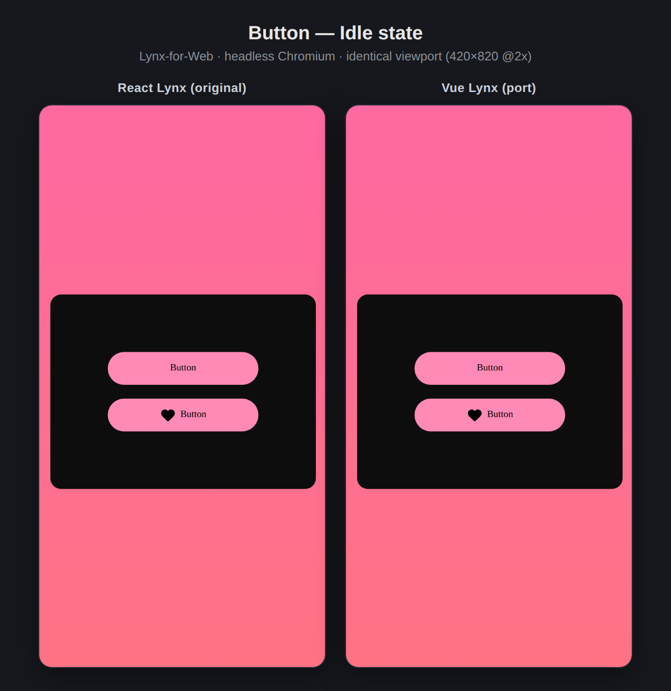
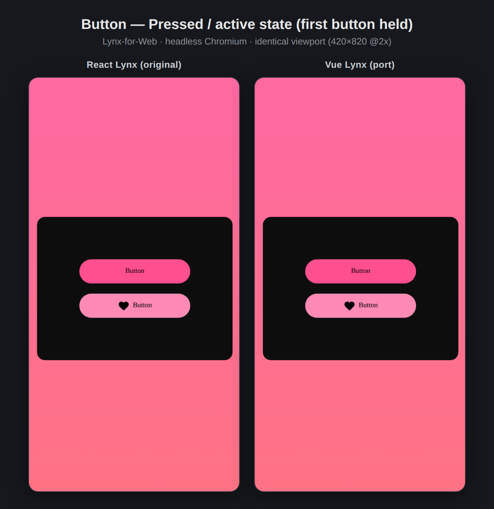

# vue-lynx-ui

A **Vue Lynx** port of [`@lynx-js/lynx-ui`](../packages) — the official ReactLynx
headless UI library. The aim is a Vue 3 abstraction whose public API **mirrors
the original ReactLynx implementation 1:1**, verified for visual and interaction
parity through Lynx-for-Web.

Built on [Vue Lynx](https://vue.lynxjs.org) (`vue-lynx`), scaffolded with
`npm create vue-lynx`.

> **Start here:** [`CLAUDE.md`](./CLAUDE.md) is the porting guide — the
> ReactLynx→Vue Lynx API cheat sheet, project conventions, and the verification
> harness. Read it before porting the next component.

## Status

| Component | Source ported from | Visual parity | Interaction parity |
| --- | --- | --- | --- |
| **Button** | `packages/lynx-ui-button` | ✅ pixel-identical | ✅ press/active + tap |

## Layout

```
src/
  components/button/   # the Button port (Button.vue, types, context, composable)
  examples/button/     # Basic demo, mirror of apps/examples/Button/Basic
  styles/luna/         # luna design tokens (copied from @lynx-js/luna-styles)
  index.ts             # entry — renders the Button Basic example
docs/evidence/         # side-by-side React vs Vue screenshots
scripts/               # Playwright screenshot / interaction / compose helpers
```

## Develop

```bash
npm install
npm run dev      # serves lynx + web bundles and the /__web_preview page
npm run build
```

Scan the QR code in the terminal with LynxExplorer to run natively, or open the
`__web_preview` URL for the Lynx-for-Web preview.

## Verify against the React original

See [`CLAUDE.md` §4](./CLAUDE.md) for the full side-by-side harness. Evidence for
the Button is in [`docs/evidence/`](./docs/evidence).

| Idle | Pressed / active |
| --- | --- |
|  |  |
